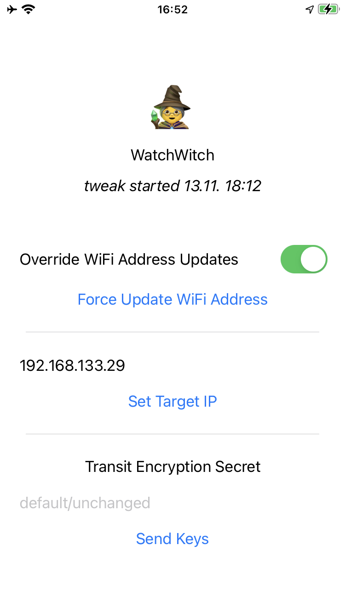

# WatchWitch iOS Support

Supporting iOS components for the [WatchWitch App](https://github.com/seemoo-lab/watchwitch) for Android.  

To allow the Android app to communicate with the Apple Watch, we have to extract key material and redirect communication on a paired, jailbroken iPhone. This repo contains:

* The `watchwitch` tweak, which hooks into the terminus and identityservices daemons to extract keys and config data
* The `watchwitchcompanion` app, which exposes some settings and sends extracted data to the WatchWitch Android app

Both components require a root-ful iOS jailbreak and have been tested on iOS 14.8. More recent versions and rootless jailbreaks may require minor modifications. The companion app requires iOS 14 or upward to work.

## Usage



Open the app, you should see the tweak start time being displayed indicating that communication between the tweak and the app is working as intended.

Enter the WiFi IP address of your Android phone running [WatchWitch Android](https://github.com/seemoo-lab/watchwitch), then tap 'Set Target IP' to confirm.

With the Android app running, tap "Send Keys". A 'got keys!' message should appear on your Android phone. To better protect the transferred key material, you should set a custom transit secret in the app and enter the same secret on the Android side. Otherwise the app will fall back to a default secret which is strong, but technically public.

Enable the WiFi address override, and force an address update if you like. When losing Bluetooth connection, your watch will now connect to your Android phone instead of your iPhone.

## Building

Make sure [Theos](https://theos.dev/docs/) is installed on your computer. Dependencies and version incompatibilities can be tricky on linux, macOS might work more smoothly.

You will also need [Cephei](https://hbang.github.io/libcephei/) installed on your iPhone. To use Cephei with Swift, you may have to copy the [module maps](modulemaps) to your `$THEOS/vendor/lib` folder, e.g. `cp modulemaps/Cephei/* $THEOS/vendor/lib/Cephei.framework/Modules`. This may not be necessary anymore with current versions of theos.

If you have trouble compiling the app or the tweak, you can use pre-built binaries from the releases.  

Connect your iPhone:
```
iproxy 2222 22
export THEOS_DEVICE_IP=localhost
export THEOS_DEVICE_PORT=2222
```

Install the tweak:
```
cd watchwitch-tweak
make package install
```

Install the app:
```
cd watchwitch-app
make package install
```

